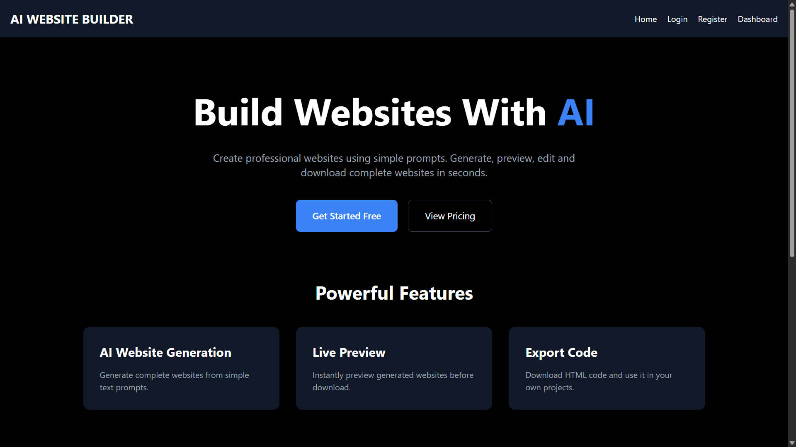
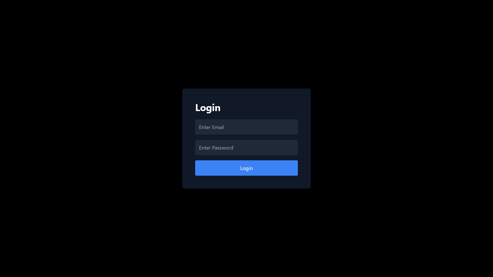
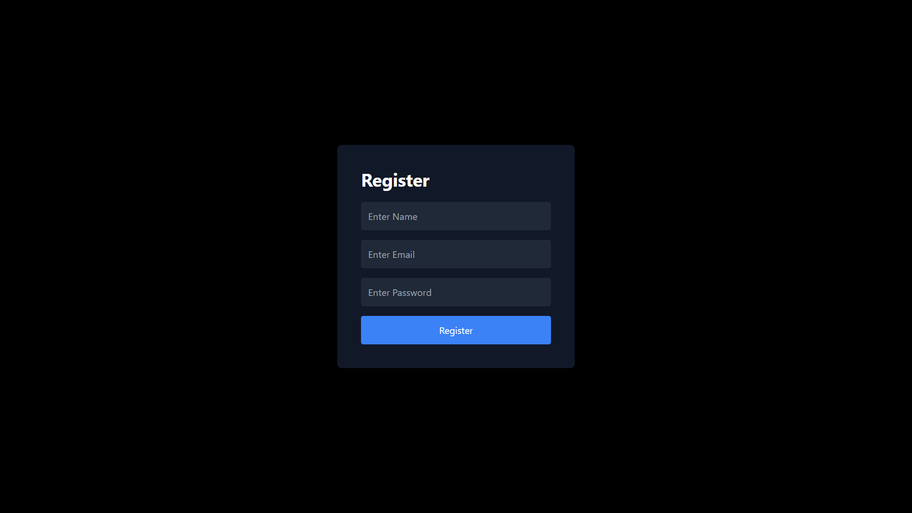
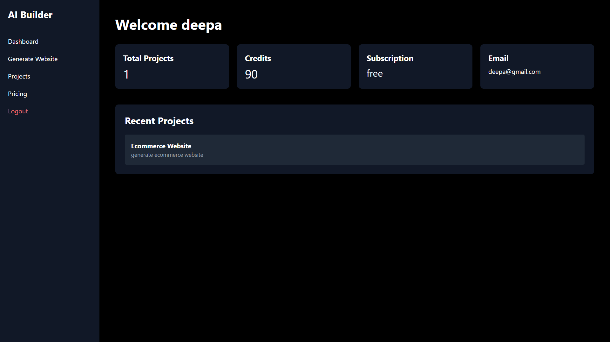
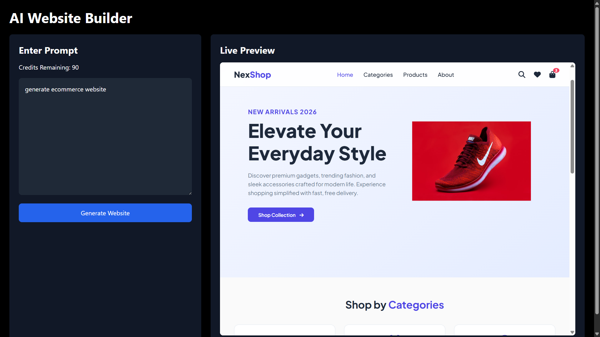
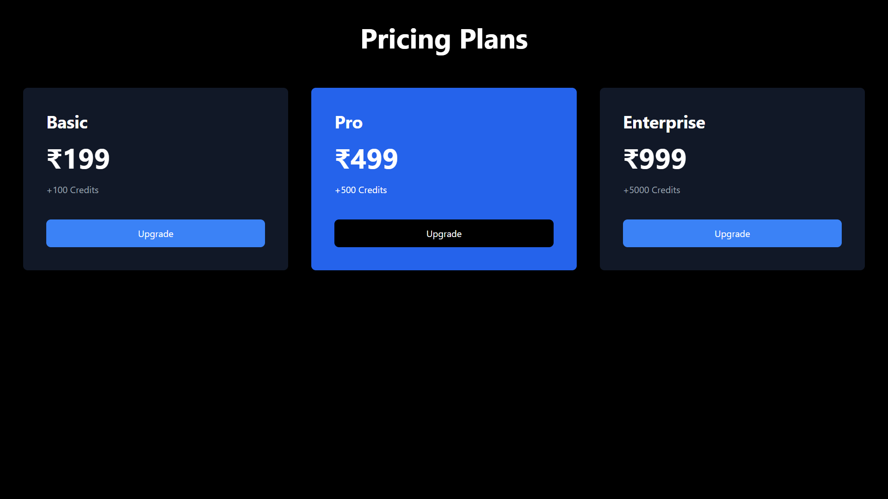

# 🚀 AI Website Builder

> An AI-Powered SaaS Website Builder built with the MERN Stack that enables users to securely register, log in, manage projects, and generate responsive websites through an intuitive web interface.


# 🌐 Live Demo

### 🔗 Website

https://ai-website-builder-frontend-eight.vercel.app


# 📖 Overview

AI Website Builder is a modern Full Stack SaaS application developed using React, Node.js, Express.js, and MongoDB.

The application provides a secure authentication system, protected dashboard, project management features, and an AI-ready architecture for future website generation capabilities.

This project demonstrates modern Full Stack Development practices including Authentication, REST APIs, Database Integration, Deployment, and Responsive UI Design.


# ✨ Features

* Secure User Registration
* JWT Authentication
* Password Encryption using bcrypt
* Login & Logout
* Protected Routes
* User Dashboard
* Project Management
* Website Generation 
* Responsive Design
* REST API Architecture
* MongoDB Database
* Production Deployment


# 🛠 Tech Stack

## Frontend

* React.js
* Vite
* Tailwind CSS
* Axios
* React Router DOM


## Backend

* Node.js
* Express.js
* JWT Authentication
* bcryptjs
* CORS


## Database

* MongoDB Atlas
* Mongoose


## Deployment

* Vercel (Frontend)
* Render (Backend)
* GitHub


# 📂 Project Structure

```text
AI Website Builder
│
├── client
│   ├── src
│   ├── public
│   ├── components
│   ├── pages
│   ├── services
│   └── assets
│
├── server
│   ├── config
│   ├── controllers
│   ├── middleware
│   ├── models
│   ├── routes
│   ├── server.js
│   └── package.json
│
├── screenshots
│
├── README.md
│
└── .gitignore
```


# 🔐 Authentication

The project implements secure authentication using JSON Web Tokens (JWT).

Features include:

* Password Hashing
* Secure Login
* Protected Routes
* Token Based Authentication
* User Session Management


# 📡 API Modules

* Authentication
* User Management
* Project Management
* AI Website Generation


# 🚀 Installation

## Clone Repository

```bash
git clone https://github.com/deepaliyadav01/AI-Website-Builder.git
```


## Frontend

```bash
cd client

npm install

npm run dev
```


## Backend

```bash
cd server

npm install

npm run dev
```


# ⚙ Environment Variables

Create your own environment variables before running the project.

Example:

```env
PORT=5000

MONGO_URI=YOUR_MONGODB_URI

JWT_SECRET=YOUR_SECRET_KEY

VITE_API_URL=YOUR_BACKEND_API
```


# 📸 Screenshots

## 🏠 Home Page




## 🔐 Login Page




## 📝 Register Page




## 📊 Dashboard




## 🤖 AI Website Generation




## 💳 Pricing Page




# 📈 Future Enhancements

* Payment Gateway Integration
* One Click Deployment
* Admin Dashboard
* Team Collaboration
* Email Verification
* Password Reset


# 🎯 Learning Outcomes

This project demonstrates practical knowledge of:

* React.js
* Node.js
* Express.js
* MongoDB
* JWT Authentication
* REST APIs
* Full Stack Development
* Deployment using Render & Vercel
* Git & GitHub
* SaaS Application Development


# 👩‍💻 Author

**Deepali Yadav**

Aspiring Software Developer


# ⭐ Show Your Support

If you like this project, consider giving it a ⭐ on GitHub.
